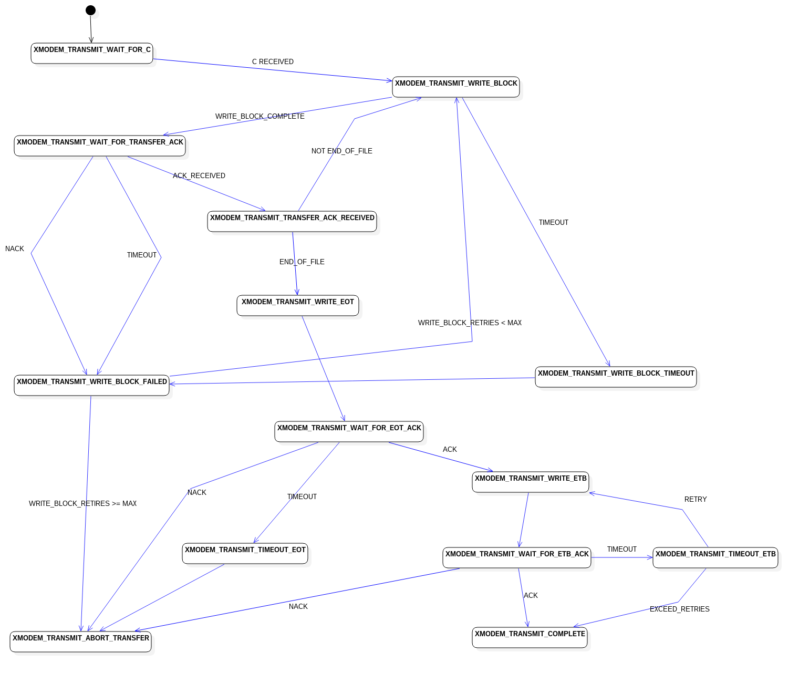
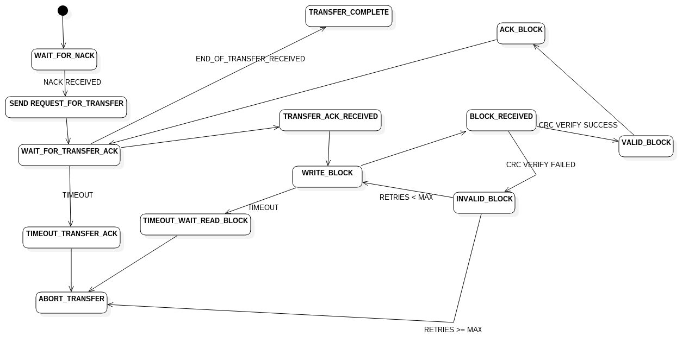

Embedded XModem
===============

[](https://travis-ci.org/bsail/xmodem)
[](https://coveralls.io/github/bsail/xmodem?branch=master)

Fork of original library by [caseykelso](https://github.com/caseykelso/xmodem).

Forked by Nikolay Nerovny, BMSTU, 2018.

Latest version of library:

  https://github.com/bsail/xmodem

# Development
For developers looking to extend, bug fix, build, and test libXMODEM with dependencies and test infrastructure included in the source tree. This version differs from original version by [caseykelso](https://github.com/caseykelso/xmodem): it uses Ceedling build system with Unity tests.
This library has several changes in transmitter state machine in order to properly work with `rz` utility: it did not wait for 'C', it starts transmission from the beginning.


Setup Environment - Ubuntu 16.04/18.04
---------------------------------
```bash
sudo apt install build-essential git ruby
sudo gem install ceedling
```


Get Code
-----------------
```bash
mkdir xmodem
git clone https://github.com/bsail/xmodem xmodem
ceedling upgrade xmodem
cd xmodem
```

# Tests
## Unit Tests

Build & Run Unit Tests
```bash
ceedling test:all
```
You may use and create additional tasks for Ceedling build system. Please refer to the documentation in the `vendor/ceedling/docs`.


### Transmit State Machine
All transitions are covered via unit tests.



### Receive State Machine
All transitions are NOT YET covered via unit tests.




# Project Structure
## Source Directories
* /src - libxmodem source directory
  * xmodem.h - common header (transmitter and receiver)
  * xmodem.c - common implementation (transmitter and receiver)
  * xmodem_receiver.h - receiver side header
  * xmodem_receiver.c - receiver side implementation
  * xmodem_transmitter.h - transmitter side header
  * xmodem_transmitter.c - transmitter side implementation


* /test
  * test_xmodem.c - Unity test file for xmodem.c module (use `ceedling test:xmodem` to run tests only in this source file)
  * test_xmodem_receiver.c - Unity test file for xmodem_receiver.c module (use `ceedling test:xmodem_receiver` to run tests only in this source file)
  * test_xmodem_transmitter.c - Unity test file for xmodem_transmitter.c module (use `ceedling test:xmodem_transmitter` to run tests only in this source file)


* /
  * README.md   - this file
  * project.yml - Ceedling project file including parameters of test compiler and linker
  * .gitignore  - definitions of files and directories to be ignored by git


## Third Party Source Directories
* /vendor  - Ceedling source with documentation and plugins

## Build Directories
* /build - Ceedling library build directory

## Additional Directories
* /documentation - Source of state machine schematics
* /reference - Reference documentation about xmodem protocol

